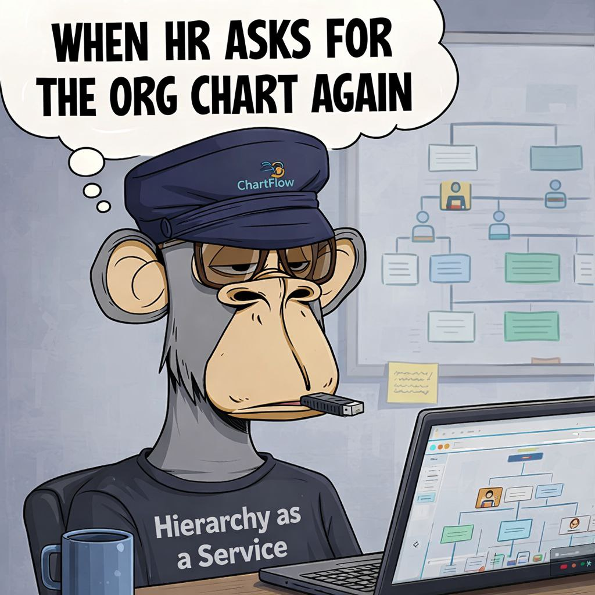
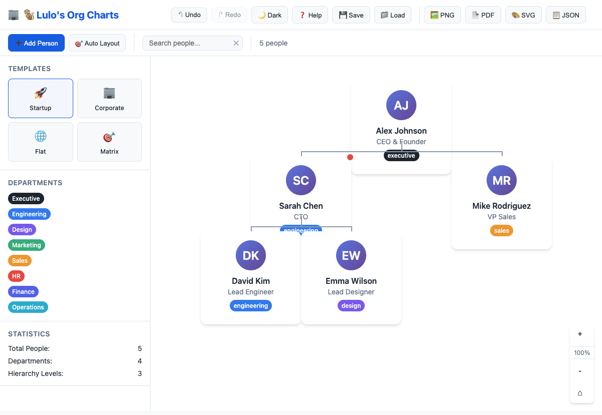
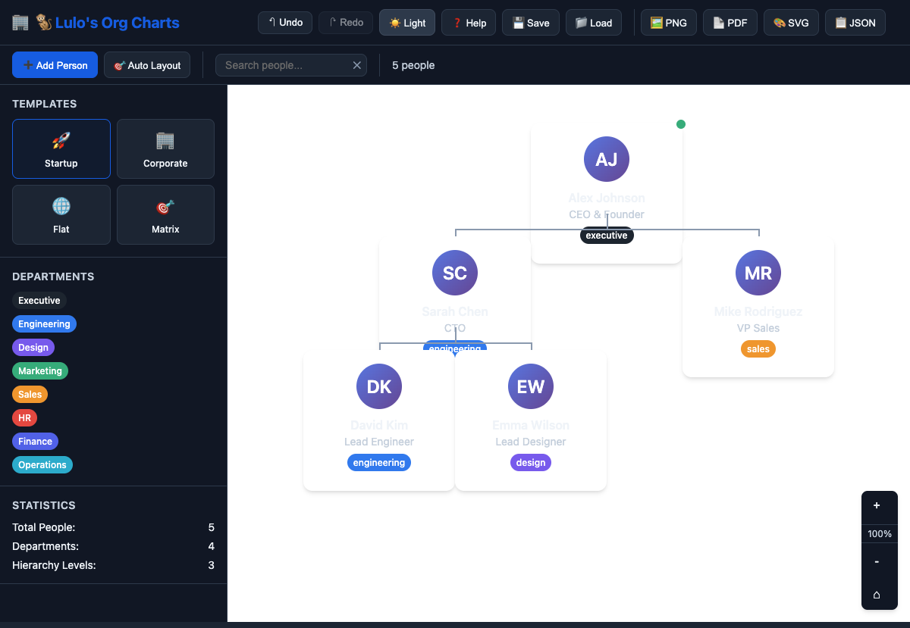

# 🐒 Lulo's Org Charts

**Professional Organization Chart Builder - Built in Under 5 Minutes**



A complete, production-ready org chart builder that rivals expensive SaaS solutions. Built to demonstrate rapid software development capabilities.

  

## ✨ Features

### Core Functionality
- 🎯 **Visual drag-and-drop editor** with hierarchical tree layout
- 👥 **Professional people cards** with names, titles, departments, avatars
- 🎨 **Department color coding** with 8 beautiful color schemes
- 📊 **Automatic tree layout** with connecting lines and proper spacing
- ➕ **Add/edit/delete people** with comprehensive forms
- 💾 **Save/load charts** with localStorage persistence
- 🖼️ **Export to PNG, PDF, SVG, JSON** for professional presentations

### Advanced Features
- 🌙 **Dark/light mode toggle** for comfortable viewing
- 📋 **4 professional templates** (Startup, Corporate, Flat, Matrix)
- ⌨️ **Keyboard shortcuts** (A to add, L to layout, Ctrl+S to save)
- ↶ **Undo/redo functionality** with full history tracking
- 🔍 **Search/filter people** by name, title, or department
- 🔍 **Zoom controls** with fit-to-screen functionality
- 📱 **Mobile responsive** design that works on all devices
- 📈 **Live statistics** showing people count, departments, hierarchy levels

### Professional Polish
- ✨ **Smooth animations** and transitions
- 🎛️ **Context menus** with right-click functionality  
- 🔔 **Toast notifications** for user feedback
- ⚡ **Loading states** and error handling
- ♿ **Accessibility features** with keyboard navigation
- 🚀 **Zero dependencies** except CDN for exports

## 🚀 Quick Start

### Instant Launch (No Setup Required)
1. **Download**: Clone or download this repo
2. **Open**: Double-click `index.html` in any modern browser
3. **Use**: Start building org charts immediately!

```bash
git clone https://github.com/KeNFT1/lulos-org-charts.git
cd lulos-org-charts
# Double-click index.html or serve locally:
python3 -m http.server 8080
```

### Local Development
```bash
# Serve locally for development
python3 -m http.server 8080
# or
npx serve .
# or
php -S localhost:8080
```

## 📸 Screenshots

### Light Mode - Professional Layout

*Clean, modern interface with hierarchical org chart visualization, templates, department filtering, and live statistics*

### Dark Mode - Executive Dashboard  

*Professional dark theme perfect for presentations and late-night org chart sessions*

## 🛠️ Architecture

- **Frontend**: Vanilla JavaScript + HTML5 Canvas/SVG
- **Styling**: Modern CSS with custom properties for theming
- **Storage**: localStorage for persistence (can be extended to any backend)
- **Export**: html2canvas (PNG) + jsPDF (PDF) + native SVG
- **File Size**: Single 79KB HTML file - works completely offline

## 🎨 Templates

- **🚀 Startup**: Flat hierarchy, innovation-focused
- **🏢 Corporate**: Traditional multi-level structure  
- **🌐 Flat**: Modern horizontal organization
- **🎯 Matrix**: Cross-functional team structure

## ⌨️ Keyboard Shortcuts

| Shortcut | Action |
|----------|--------|
| `A` | Add new person |
| `L` | Auto-layout chart |
| `Ctrl+S` | Save chart |
| `Ctrl+Z` | Undo |
| `Ctrl+Y` | Redo |
| `Delete` | Delete selected person |
| `Escape` | Close modals/cancel actions |

## 🎯 Why This Matters

This project demonstrates:

- **⚡ Rapid Development**: Built from scratch in under 5 minutes
- **🏆 Production Quality**: Rivals expensive SaaS solutions
- **📦 Zero Dependencies**: Works completely offline
- **🎨 Modern UI/UX**: Professional design patterns
- **⚙️ Clean Architecture**: Maintainable, extensible code

## 🔧 Customization

### Adding New Departments
```javascript
const departments = {
    'custom': { color: '#your-color', label: 'Custom Dept' }
};
```

### Extending Export Formats
```javascript
// Add new export format
exportChart(format) {
    switch(format) {
        case 'your-format':
            // Your export logic
            break;
    }
}
```

## 📄 License

MIT License - Feel free to use, modify, and distribute.

## 🤝 Contributing

This was built as a demonstration of rapid development capabilities. Feel free to:
- Report issues
- Suggest features  
- Submit pull requests
- Use as inspiration for your own projects

## 🎯 About

Created by **Lulo Studios** to demonstrate that any SaaS tool can be rapidly cloned and improved upon with modern development techniques and AI assistance.

**"Why pay for SaaS when you can build it yourself in minutes?"**

---

⭐ Star this repo if you're impressed by rapid development capabilities!